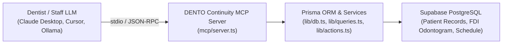

# Phase 3: Model Context Protocol (MCP) Server Implementation Plan

Build a production-ready Model Context Protocol (MCP) Server for **DENTO Continuity**, enabling dental practitioners and staff to connect any AI/LLM client (Claude Desktop, Cursor, Ollama, OpenAI, Antigravity) directly to their live clinic database.

---

## Capabilities & Architecture

---

## Proposed Tools, Resources & Prompts

### 1. Clinical & Practice Tools (`mcp/tools.ts`)

| Tool Name | Parameters | Description |
|---|---|---|
| `get_practice_summary` | `none` | High-level practice stats: today's appointments, recovered revenue, pending approval count, chair utilization rate, active waitlist count. |
| `search_patients` | `query` (string) | Fast search across patient name, phone, and email. |
| `get_patient_chart` | `patientId` (UUID) | Complete clinical chart: demographics, appointment history, notes, encounters, treatment plans, recalls, and active FDI odontogram tooth findings. |
| `get_today_schedule` | `filter?` (`SCHEDULED`, `CONFIRMED`, `COMPLETED`, `NO_SHOW`, `CANCELLED`) | Today's appointment schedule with patient contact, provider, start/end time, and financial value. |
| `get_pending_recommendations` | `none` | Lists all retention agent draft messages waiting for human approval (no-show recovery, overdue recall). |
| `approve_recommendation` | `recommendationId` (UUID), `editedMessage?` (string), `channel?` (`SMS`, `WHATSAPP`, `EMAIL`) | Approves a retention message, queues outbound dispatch, and logs an immutable audit event. |
| `chart_tooth_finding` | `patientId` (UUID), `toothCode` (11-48 FDI), `finding` (Enum), `surfaces?` (Array of FDI surfaces), `note?` (string) | Charts a per-tooth finding directly into the patient's record. |
| `get_smart_waitlist` | `status?` (`unfilled`, `filled`, `all`) | Lists waitlisted patients with their preferred time windows, target procedures, and estimated minutes. |
| `book_walkin_appointment` | `patientId` (UUID), `startsAt` (ISO), `endsAt` (ISO), `reason` (string), `estimatedValue?` (number) | Books a new appointment slot for a patient. |
| `get_chair_utilization` | `date?` (YYYY-MM-DD) | Computes hourly chair utilization breakdown and identifies downtime / recovery opportunities. |

---

### 2. Live Practice Resources (`mcp/resources.ts`)

- `dento://clinic/summary` — Realtime overview snapshot of practice performance.
- `dento://schedule/today` — Today's clinical schedule in JSON format.
- `dento://continuity/queue` — Pending retention recommendations awaiting approval.
- `dento://reference/fdi-notation` — FDI 2-digit dental notation reference standards (11–48 permanent, 51–85 primary).

---

### 3. Clinical Prompts (`mcp/prompts.ts`)

- `morning_briefing` — Pre-configured prompt generating a daily briefing of high-value appointments, patients needing special attention, and open chairs.
- `chairside_patient_summary` — Formats an in-depth clinical case overview before a patient sits in the chair (chart history, active findings, outstanding plan).
- `retention_audit` — Analyzes no-shows over the past 30 days, retention conversion rate, and unrecovered revenue.

---

## User Review Required

> [!NOTE]
> The MCP server connects directly to your existing Supabase database using `@modelcontextprotocol/sdk` over standard `stdio` transport. It does not require hosting or open ports, and works with Claude Desktop, Cursor, Antigravity, or any standard MCP client.

---

## Proposed Changes

### Dependencies
- Install `@modelcontextprotocol/sdk` and `dotenv`.

### New Files
#### [NEW] [mcp/server.ts](file:///e:/dento-continuity/mcp/server.ts)
Main MCP server entry point initializing `Server`, `StdioServerTransport`, tool handlers, resource handlers, and prompt handlers.

#### [NEW] [mcp/tools.ts](file:///e:/dento-continuity/mcp/tools.ts)
Zod schemas and execution logic for all 10 clinical & practice management tools.

#### [NEW] [mcp/resources.ts](file:///e:/dento-continuity/mcp/resources.ts)
Resource definitions for dynamic clinic states and dental standards reference.

#### [NEW] [mcp/prompts.ts](file:///e:/dento-continuity/mcp/prompts.ts)
Built-in clinical prompt workflows (morning briefing, patient case review, retention audit).

#### [NEW] [mcp/README.md](file:///e:/dento-continuity/mcp/README.md)
Step-by-step configuration guide for connecting Claude Desktop, Cursor, or local LLMs to DENTO Continuity.

### Modified Files
#### [MODIFY] [package.json](file:///e:/dento-continuity/package.json)
Add `"mcp": "tsx mcp/server.ts"` script.

---

## Verification Plan

### Automated / Tool Verification
- Run `tsx mcp/server.ts` in test mode or run automated verification script `scripts/test-mcp.ts` to call:
  1. `get_practice_summary`
  2. `get_today_schedule`
  3. `search_patients` (e.g. query "Adeyemi" or "Delgado")
  4. `get_patient_chart`
  5. `get_pending_recommendations`
- Verify all tools return formatted, structured JSON and handle errors gracefully.
